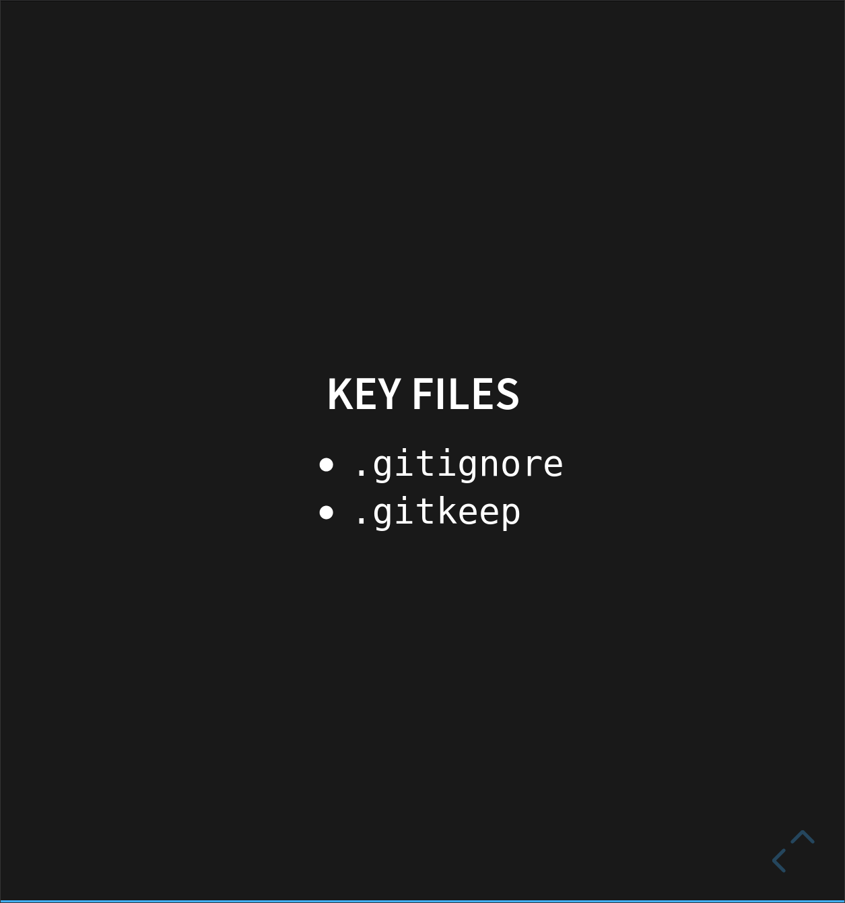

{:width="20%"}

What if we have files that we **do not** want Git to track for us,
like **backup files** created by our editor
or **intermediate** files created during data analysis.
Let's create a few dummy files:

~~~
$ mkdir results
$ touch a.dat b.dat c.dat results/a.out results/b.out
~~~
{: .language-bash}

and see what Git says:

~~~
$ git status
~~~
{: .language-bash}

~~~
# On branch master
# Untracked files:
#   (use "git add <file>..." to include in what will be committed)
#
#	a.dat
#	b.dat
#	c.dat
#	results/
nothing added to commit but untracked files present (use "git add" to track)
~~~
{: .output}

Putting these files under version control would be a **waste of disk space**.
What's worse,
having them all listed could **distract** us from changes that actually matter,
so let's tell Git to **ignore** them.

{:width="20%"}

We do this by creating a file in the root directory of our project called `.gitignore`.

~~~
$ nano .gitignore
$ cat .gitignore
~~~
{: .language-bash}

~~~
*.dat
results/
~~~
{: .output}

These patterns tell Git to **ignore** any file whose name ends in **`.dat`**
and everything in the **`results`** directory.
(If any of these files were **already** being tracked,
Git would **continue** to track them.)

Once we have created this file,
the output of `git status` is much cleaner:

~~~
$ git status
~~~
{: .language-bash}

~~~
# On branch master
# Untracked files:
#   (use "git add <file>..." to include in what will be committed)
#
#	.gitignore
nothing added to commit but untracked files present (use "git add" to track)
~~~
{: .output}

The only thing Git notices now is the newly-created `.gitignore` file.
You might think we wouldn't want to track it,
but everyone we're **sharing** our repository with will probably **want to ignore
the same** things that we're ignoring.
Let's add and commit `.gitignore`:

~~~
$ git add .gitignore
$ git commit -m "Add the ignore file"
$ git status
~~~
{: .language-bash}

~~~
# On branch master
nothing to commit, working directory clean
~~~
{: .output}

As a bonus,
using `.gitignore` helps us **avoid accidentally adding files** to the repository that we don't want.

~~~
$ git add a.dat
~~~
{: .language-bash}

~~~
The following paths are ignored by one of your .gitignore files:
a.dat
Use -f if you really want to add them.
fatal: no files added
~~~
{: .output}

If we really want to override our ignore settings,
we can use `git add -f` to force Git to add something.
We can also always see the status of ignored files if we want:

~~~
$ git status --ignored
~~~
{: .language-bash}

~~~
# On branch master
# Ignored files:
#  (use "git add -f <file>..." to include in what will be committed)
#
#        a.dat
#        b.dat
#        c.dat
#        results/

nothing to commit, working directory clean
~~~
{: .output}


