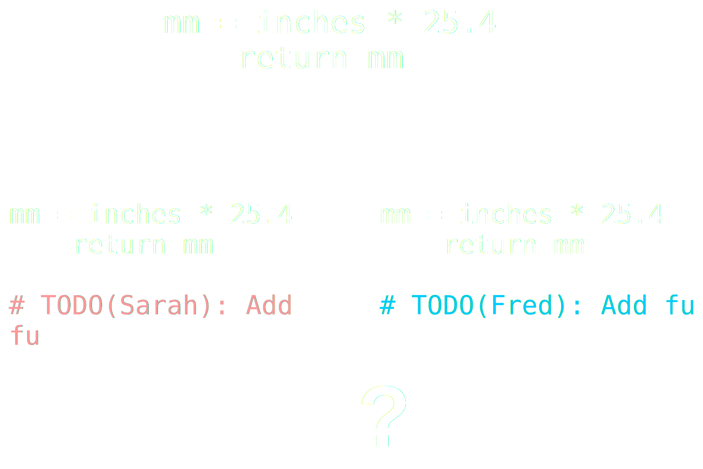

% Software Carpentry
% Southampton RSG

## 0. Introduction

### Before We Start

- Create an account at [github.com](https://www.github.com)
- Partner up with the person next to you
- Open up a terminal
- Download the materials
- `git clone https://github.com/Southampton-RSG/swc-git-novice`

## 1. What is Version Control?

### What Does It Do?

- Tracks **changes** to files
- Any file can be tracked
- Text (.txt, .csv, .py, .c, .R, etc.) works best
  - These allow smart *diff* / *merge* etc.

### Why Use Version Control?

- A more <ins>efficient</ins> backup
- Reproducibility

### Why Use Version Control?

- Teamwork

### Version Control Tracks Changes

### Version Control Tracks Changes

### Version Control Tracks Changes

### Version Control Alternatives

- Git
  - Distributed
- Subversion (svn)
  - Centralised
- Mercurial (hg)
  - Distributed

- Git most widely used in academia
  - GitHub
  - GitLab

### Graphical Version Control

<table>
  <tr>
    <th>SourceTree</th>
    <th>Git Kraken</th>
    <th>Git Desktop</th>
  </tr>
  <tr>
    <td></td>
    <td></td>
    <td></td>
  </tr>
</table>

## 1. Setting Up Git

### Key Commands

- `git config`

## 2. Creating a Repository

### Key Commands

- `git init`
- `git status`

## 3. Tracking Changes

### Key Commands 

- `git add`
- `git commit`

### Adding & Committing

### History

- `git log`
- `git diff`

### Differences

## 4. Exploring History

### More Differences

### Restoring Files

- `git checkout`

### Restoring Files

## 5. Collaborating

### Local Repo

### Collaboration

### Pair Up

- Let's collaborate via remote repo
- Working in pairs:
  - **Developer A**
  - **Developer B**

### Remote Repositories: A

- **Developer A**
  - Sign in to [github.com](https://www.github.com)
  - Create repository
  - `git remote add`
  - `git push`
  - Add **Developer B** as collaborator

### Remote Repositories: B

- **Developer B**
  - Clean up
  - `git clone`
  - `git add`
  - `git commit`
  - `git push`

### Remote Repositories: A

- **Developer A**
  - `git pull`

### Exercises

- **Developer A**
  - Add README.md containing authors & info
- **Developer B**
  - Sync up your repository

## 6. Conflicts

### Conflicts: A

### Conflicts: B

### Remote Summary

### Exercises

- **Developer A & B**
  - Add a line
- **Developer B**
  - Push your changes
- **Developer A**
  - Resolve the conflict
- **Developer A & B**
  - Get back in sync

## 7. Ignoring Things

### Key Files

- `.gitignore`
- `.gitkeep`